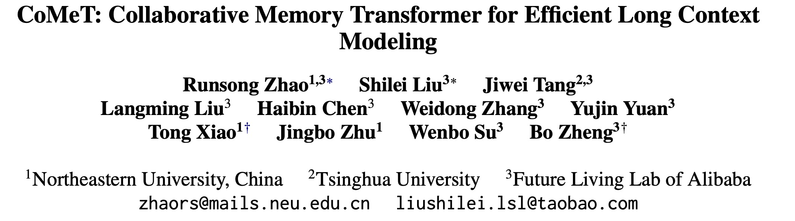

# ☄️ CoMeT: Collaborative Memory Transformer
<sub>Official Implementation · [Paper](https://arxiv.org/abs/2602.01766) · MIT License</sub>

CoMeT is an efficient long-context LLM architecture that uses collaborative global and temporal memory mechanisms to process long sequences without quadratic attention costs.



## Requirements

- Python >= 3.10
- PyTorch 2.8.0
- NVIDIA GPU with CUDA support
- [NVIDIA apex](https://github.com/NVIDIA/apex)

Install dependencies:
```bash
pip install -e .
```

## Quick Start

### 1. Download model and data

Download a supported backbone model from Hugging Face:
- [`Qwen/Qwen3-4B-Instruct`](https://huggingface.co/Qwen/Qwen3-4B-Instruct-2507)
- [`Qwen/Qwen3-0.6B`](https://huggingface.co/Qwen/Qwen3-0.6B)

Download the SCROLLS dataset (pre-processed for CoMeT):
- [Hugging Face](https://huggingface.co/datasets/OpenStellarTeam/scrolls_by_comet)
- [Kaggle](https://www.kaggle.com/datasets/liulangmingliu/scrolls-by-comet)

### 2. Pre-tokenize and pack data

```bash
bash scripts/tokenize.sh
```

### 3. Train

```bash
bash scripts/train.sh
```

### 4. Inference

```bash
bash scripts/infer.sh
```

## Available Models
The comet model trained on the scrolls dataset is available for testing via the link below:

[Comet-Qwen3-4b-on-Scrolls](https://www.kaggle.com/models/liulangmingliu/comet-qwen3-4b-on-scrolls)

## Citation

If you find this work useful, please cite:

```bibtex
@misc{zhao2026cometcollaborativememorytransformer,
      title={CoMeT: Collaborative Memory Transformer for Efficient Long Context Modeling},
      author={Runsong Zhao and Shilei Liu and Jiwei Tang and Langming Liu and Haibin Chen and Weidong Zhang and Yujin Yuan and Tong Xiao and Jingbo Zhu and Wenbo Su and Bo Zheng},
      year={2026},
      eprint={2602.01766},
      archivePrefix={arXiv},
      primaryClass={cs.LG},
      url={https://arxiv.org/abs/2602.01766},
}
```

## License

This project is released under the [MIT License](LICENSE).
